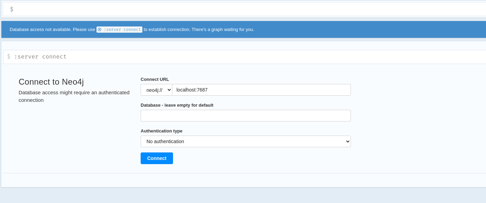

# simple_sql_lineage
Get lineage from SQL files. This might be of help if your project is a mess.
Oh, my life is better after this one.

### Install
As simple as:
```bash
poetry install
```

### Run
1. Run docker compose
```bash
docker compose up -d
```

2. Create a .env file from the ```.env-template```, filling the value of ```SIMPLE_LINEAGE_ROOT_FOLDER``` variable.

3. Do:
```bash
poetry run python3 simple_lineage_generator/simple_lineage_generator.py
```
It might take a while to do everything needed.

4. After finished, open Neo4j.
```http://localhost:7474```

First time you access, you might face this screen, just choose "No Authentication"


### Shutting down
1. Kill docker compose
```bash
docker compose down
```
2. If you wanna get rid of your neo4j data:
```bash
sudo rm -rf .neo4j
```
### Useful queries:
- Get all tables that directly source from a table
```cypher
MATCH (t:Table {name: 'raw_microservices.offers'})<-[r:SOURCES_FROM]-(x:Table) RETURN t, x
```

- Get all column that inherit from a column up to 10 connection levels
```cypher
MATCH (n:Column {name: 'competitors_set.competitors_rank'})-[:SOURCES_FROM*1..10]->(m:Column)
RETURN n, m
```
- Get all columns up to 3 levels frm the original column and also all tables in 1 level distant

```cypher
MATCH (x:Column {name: 'column  name'})<-[:SOURCES_FROM*1..3]-(y:Column),
      (x)-[:HAS_COLUMN*1]->(z:Table)
RETURN y, z
```

- Get the table lineage database with more conenctions to it
```cypher
MATCH (t:Table)-[r]-(x)
WITH distinct t,x, 
    COUNT(r) as con_count
ORDER BY con_count DESC
RETURN t
LIMIT 1
```

Now plot these 1st level realtionships
```cypher
MATCH (t:Table {name: 'table name'})-[r]-(x)
RETURN t, x
```
# Needed improvements
- [ ] Docstrings. This thing was created in just 3 days, so no time to do it properly
- [ ] Unit tests. Same reason as above
- [ ] Improve parsing for less errors.
-----
## Thanks
- Lineage was built using [sqllineage](https://sqllineage.readthedocs.io/en/latest/_modules/sqllineage/runner.html#LineageRunner)

- Thanks, Caetano Veloso, for providing an incredible soundtrack for coding this.